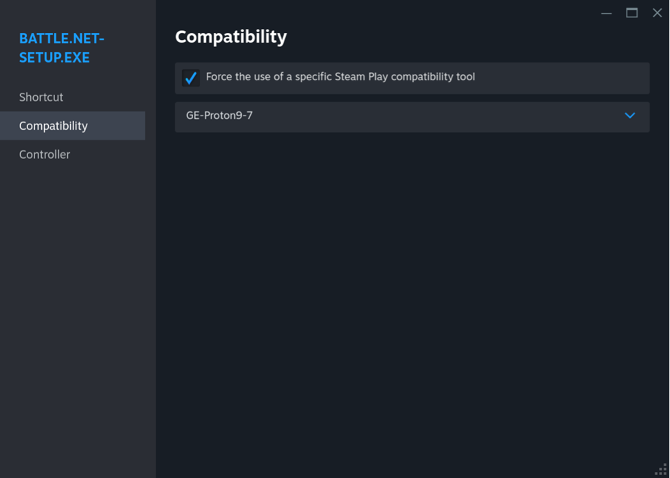
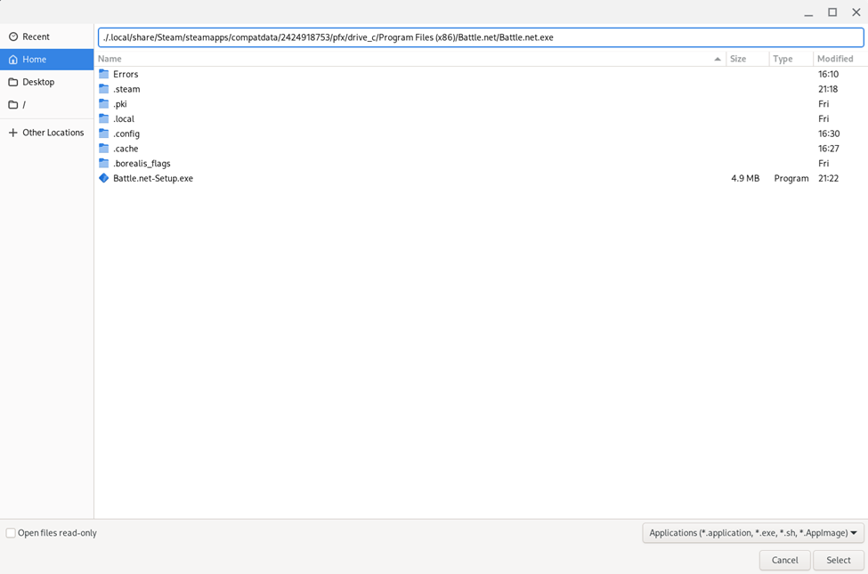
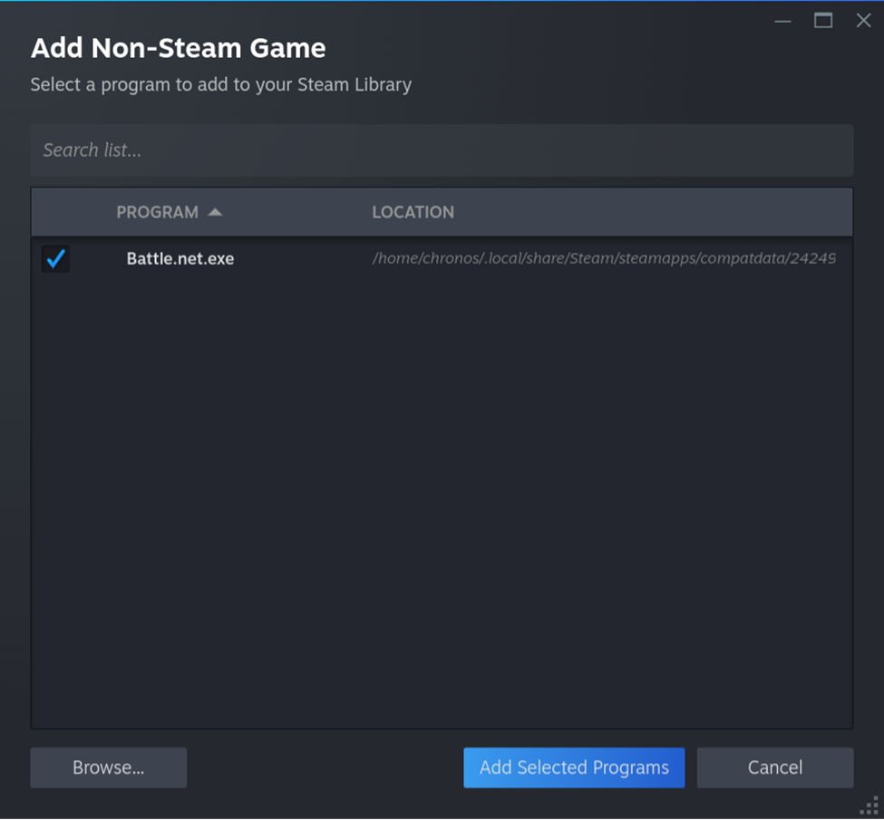

# How to install battle.net on ChromeOS (ASUS CM3401)

I was able to install battle.net through Steam Beta on ChomeOS (ASUS CM3401). We even get working GPU acceleration (AMD Radeon VirtIO) through GE Proton out of the box. This is a short guide on how it was done.


## Screen Capture
A little video of it in action

https://github.com/kbridgford/chromeOSBattleNet/assets/57777806/e62f4542-1a3f-4446-b028-a61aab376a78

We need to get the latest version of GE Proton loaded into steam. Proton is the virtualization layer that allows us to launch windows apps (like battle.net). I didn't have any luck with Proton stable or Proton Experimental. Only worked with GE Proton.

## Assumptions

1. You have already installed Steam Beta on a supported Chromebook. There are lots of [guides](https://beebom.com/how-install-play-steam-games-chromebook/) out there.
2. You have decent command line skills. This guide isn't for beginners.

## Steps

Log into your Chromebook

Open Chrome browser and save these two files into your Downloads folder:

1. The latest version of [battle.net](https://downloader.battle.net//download/getInstallerForGame?os=win&gameProgram=BATTLENET_APP&version=Live).
2. The latest version of [GE Proton](https://github.com/GloriousEggroll/proton-ge-custom/releases/latest). Download the `.tar.gz`. **Make note of the file name**.

Launch Steam. This starts the borealis environment. **Don't close Steam.**

Click back to your desktop and launch a Crosh Terminal `ctrl+alt+t`

We'll share our Downloads folder with borealis (Steam), then open a borealis shell. After that we'll copy our files over.

````
# Share downloads folder

vmc share borealis Downloads

# make note of the path in the console output

# Open a borealis shell

vsh borealis

# Copy the battle.net installer and GE Proton from the Downloads folder into our home directory

cp /mnt/shared/MyFiles/Downloads/Battle.net-Setup.exe ./
cp /mnt/shared/MyFiles/Downloads/GE-Proton9-7.tar.gz ./

# Create directory in Steam folder and untar GE Proton into that directory

mkdir ~/.steam/root/compatibilitytools.d
tar -xf GE-Proton9-7.tar.gz -C ~/.steam/root/compatibilitytools.d/

````

Now we can quit Steam and re-launch it. This will give us the GE Proton compatibility option.

Inside steam, add a "non steam game" and browse to your home directory. Select `Battle.net-Setup.exe`.
After adding battle.net setup, change the options to force GE Proton compatibility



Launch battle.net through steam and go through the install, accepting defaults. **Don't log into battle.net, just close it out.**

Now we need to open crosh terminal and borealis shell like we did before so we can go find our newly installed battle.net

````
find -name "*Battle.net.exe"

# my install was here
./.local/share/Steam/steamapps/compatdata/2424918753/pfx/drive_c/Program Files (x86)/Battle.net/Battle.net.exe

````

Back in steam we want to add another "non-steam game" to our library. 
Force compatibility like we did before on the installer.






Now we can launch battle.net and install Starcraft 2. I had to pause and restart the download because it slowed way down. 

After this point you are set. You can launch Starcraft 2 from inside battle.net. I had to do a reboot because things weren't behaving a little slow and buggy at first, but after that it runs pretty great.

## To Do

Can't log into battle.net with a google account. Need to figure out how to fix that auth flow.